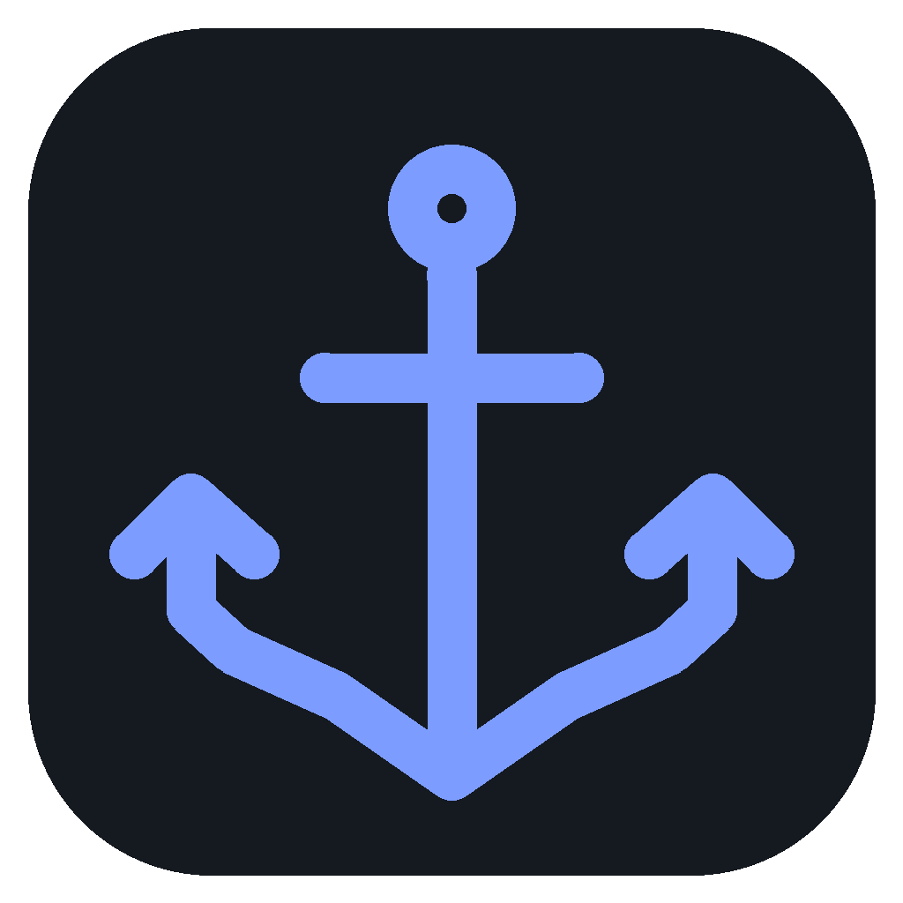

# Harbor DB

A local Electron database workbench for SQL, documents, key-value, graph, search, time-series and vector workflows. Connections go directly from your computer to your databases. No account, backend service, subscription or AI connection is required.


## Downloads

Install Harbor DB without Node.js, npm, or a source checkout. Download version **0.1.9** for your computer:

| Platform                   | Downloads                                                                                                                                                                                                                                           |
| -------------------------- | --------------------------------------------------------------------------------------------------------------------------------------------------------------------------------------------------------------------------------------------------- |
| Linux (64-bit Intel/AMD) | [DEB](https://github.com/aligeek-tech/harbor-db/releases/download/v0.1.9/Harbor-DB-0.1.9-linux-amd64.deb) · [RPM](https://github.com/aligeek-tech/harbor-db/releases/download/v0.1.9/Harbor-DB-0.1.9-linux-x86_64.rpm) · [AppImage](https://github.com/aligeek-tech/harbor-db/releases/download/v0.1.9/Harbor-DB-0.1.9-linux-x86_64.AppImage) · [Portable archive](https://github.com/aligeek-tech/harbor-db/releases/download/v0.1.9/Harbor-DB-0.1.9-linux-x64.tar.gz) |
| Linux (ARM64) | [DEB](https://github.com/aligeek-tech/harbor-db/releases/download/v0.1.9/Harbor-DB-0.1.9-linux-arm64.deb) · [RPM](https://github.com/aligeek-tech/harbor-db/releases/download/v0.1.9/Harbor-DB-0.1.9-linux-aarch64.rpm) · [AppImage](https://github.com/aligeek-tech/harbor-db/releases/download/v0.1.9/Harbor-DB-0.1.9-linux-arm64.AppImage) · [Portable archive](https://github.com/aligeek-tech/harbor-db/releases/download/v0.1.9/Harbor-DB-0.1.9-linux-arm64.tar.gz) |
| Windows (64-bit Intel/AMD) | [Setup (.exe)](https://github.com/aligeek-tech/harbor-db/releases/download/v0.1.9/Harbor-DB-0.1.9-win-x64.exe)                                                                                                                                      |
| macOS 13+ (Apple Silicon)  | [Installer (.dmg)](https://github.com/aligeek-tech/harbor-db/releases/download/v0.1.9/Harbor-DB-0.1.9-mac-arm64.dmg) · [ZIP](https://github.com/aligeek-tech/harbor-db/releases/download/v0.1.9/Harbor-DB-0.1.9-mac-arm64.zip)                      |
| macOS 13+ (Intel)          | [Installer (.dmg)](https://github.com/aligeek-tech/harbor-db/releases/download/v0.1.9/Harbor-DB-0.1.9-mac-x64.dmg) · [ZIP](https://github.com/aligeek-tech/harbor-db/releases/download/v0.1.9/Harbor-DB-0.1.9-mac-x64.zip)                          |

[All releases and release notes](https://github.com/aligeek-tech/harbor-db/releases/latest) · [SHA-256 checksums](https://github.com/aligeek-tech/harbor-db/releases/download/v0.1.9/SHA256SUMS)

Windows builds are unsigned; macOS builds use an ad-hoc signature and are not notarized. Your operating system may require an explicit installation approval. See [installation and verification instructions](docs/RELEASE.md), including the recommended `.deb` installation on Ubuntu.

Engine support has different verification levels. See the [engine support matrix](docs/CAPABILITIES.md) and [Linux distribution requirements](docs/RELEASE.md#linux-distribution-coverage). The full product roadmap remains in progress.

## Run

Use Node.js 24 LTS and npm. Installation downloads the pinned Electron binary from the official distribution.

```bash
npm ci
npm run dev
```

On Ubuntu systems that restrict unprivileged user namespaces, the first launch may need:

```bash
npm run setup:linux
npm run dev
```

Setup shows the exact AppArmor rule and requests your administrator password to install it under `/etc/apparmor.d`. It grants sandbox namespace permission only to this workspace's Electron executable and unpacked Harbor DB executable. It keeps Chromium sandboxing enabled and leaves the system-wide namespace restriction unchanged. The app itself runs without sudo. Run setup again if you move the workspace. `node scripts/linux-sandbox.mjs print` previews the rule without changing the system. This follows [Ubuntu's per-application AppArmor guidance](https://documentation.ubuntu.com/security/security-features/privilege-restriction/apparmor/).

`npm run dev` and `npm start` check this launch condition before opening Electron, so an affected terminal receives the setup instruction instead of a fatal sandbox-helper error. Automated launches may inherit another application's AppArmor permissions and therefore do not prove ordinary-terminal startup; see the validation record.

Build and run the bundled app:

```bash
npm run build
npm start
```

`npm run dev:web` opens a browser preview at `http://127.0.0.1:5173`. Its labeled demo lets you inspect the interface; database access and persistence require Electron. A fresh desktop installation starts with no saved connections.

## Isolated development databases

Docker Compose publishes only loopback ports. These credentials are development fixtures, not production defaults.

```bash
npm run db:up
npm run db:seed
```

| Engine        | Host      | Port  | User        | Password    | Database                   |
| ------------- | --------- | ----- | ----------- | ----------- | -------------------------- |
| PostgreSQL 17 | 127.0.0.1 | 15432 | harbor      | harbor_test | harbor                     |
| MariaDB 11.4  | 127.0.0.1 | 13306 | harbor      | harbor_test | harbor                     |
| MongoDB 7     | 127.0.0.1 | 17017 | harbor      | harbor_test | harbor (authSource: admin) |
| Redis 8       | 127.0.0.1 | 16379 | leave blank | harbor_test | 0                          |

The seed creates 12 customers and 100,000 orders in each SQL engine, plus 100,000 Redis benchmark keys and examples of every supported value type. Re-running the seed preserves SQL rows and refreshes its named Redis fixtures. Use `npm run db:down` to stop services; all three named data volumes remain. Redis uses its normal RDB snapshot persistence, so an abrupt container failure can lose changes since its last snapshot. Delete volumes only when you intend to remove those test databases.

MongoDB uses disposable in-memory container storage; its data is discarded when the container stops. Integration tests create and clean up generated databases. The fixture uses MongoDB 7 because [MongoDB 8 currently refuses to start on Linux kernels 6.19 and newer](https://www.mongodb.com/community/forums/t/mongodb-8-x-and-linux-kernel-6-19/337547).

TimescaleDB regression tests use an optional, disposable PostgreSQL 17 service on `127.0.0.1:15433`, with the same `harbor` / `harbor_test` development credentials. After starting the ordinary development services, enable it with:

```bash
docker compose --profile timescale up -d --wait timescale
HARBOR_INTEGRATION=1 HARBOR_TIMESCALE=1 npm test
HARBOR_INTEGRATION=1 HARBOR_TIMESCALE=1 npm run test:e2e
```

The Timescale image is pinned to version 2.27.1 and its digest. Its storage is temporary and is discarded when the container stops. Tests create and clean up their own databases. CI includes this profile; normal `npm run db:up` starts PostgreSQL, MariaDB, Redis and MongoDB.

## Daily workflow

1. Choose **Add connection**, select an engine, and fill in fields or parse a connection URL. **Test connection**, **Save**, and **Save and connect** are separate operations. Saving works while a server is offline.
2. Leave **Database** blank for PostgreSQL or MariaDB to list accessible databases under one connection. Expand a PostgreSQL database, then its schemas, to browse tables; **New query** inside a database opens an editor bound to it. An unbound PostgreSQL query asks you to choose a database before running. MariaDB queries with no default database use qualified table names. Supplying a Database keeps the explorer focused on it; **Open another database** opens a separate profile for an explicitly configured connection. The environment badge (such as production) does not choose a database. Selecting a sidebar item never retargets an existing editor.
3. Open a query with **New query**, or use the SQL editor directly below the connection context in a table tab. Table browsing displays the fetched page's SELECT with its filter, ordering, and pagination values. **Run** executes the selected text or the statement at the cursor; **Run script** executes the entire document. Edited SQL results appear below the editor. **Return to table** restores table browsing after any open transaction is completed; replacing an edited draft asks for confirmation. Restored table SQL drafts wait for you to run them or return to the table.
4. SQL table tabs fetch 200 rows by default. Use the ascending/descending arrow buttons beside each column and the server filter to fetch a filtered page. The grid search filters loaded rows. Click a cell or row number to select its row; Cmd/Ctrl-click toggles individual rows and Shift-click selects a visible range. These actions, keyboard selection, and row checkboxes share the same selection. The header checkbox selects filtered loaded rows. Use **Delete selected** to review and confirm a batch of up to 200 rows. The selection count includes rows hidden by the grid filter; refreshing a page clears selection. Deletion requires a writable connection and a primary key. Double-click an editable cell to stage changes; review and apply them together. Edited SQL results sort only their loaded rows and support selection/export; return to the table for row edits and deletion.
5. Redis has a key browser and separate console. Discover keys incrementally with SCAN. Inspect a key, stage a string change, review it, then apply. The original TTL is retained; the expiration control changes TTL explicitly.
6. MongoDB offers a database/collection browser, Extended JSON filters, and read-only aggregation pipelines. Run with **Run query** or Cmd/Ctrl+Enter. Double-click a cell to view or edit the complete document; insert, replace and delete operations show a confirmation and require writes enabled. Editing and deletion compare the original document to detect concurrent changes. MongoDB query tabs and saved queries preserve their database, collection and query mode.
7. Use **Save query** or Cmd/Ctrl+S in a query or table editor to save the displayed SQL to **Saved queries**. Opening a saved query restores its text and PostgreSQL database target without executing it; saving from a table keeps the table tab's name. History also retains the PostgreSQL database target. You can also export selected rows/loaded results. Connection imports show a preview and assign new IDs instead of overwriting existing profiles.

Read-only is initially enabled, including newly designated production profiles. Change it deliberately in the connection dialog to enable edits. Database read-only permissions are still essential: the application safeguard prevents accidental writes and is not a security boundary against hostile databases or privileged stored routines.

TimescaleDB hypertables open as limited, unsorted previews to avoid sorting the full history before displaying rows. Preview row order and offset pages may change; click a column header to request a sort. Sorting large histories can be expensive.

PostgreSQL discovery includes TimescaleDB hypertables and continuous aggregates. Extension-owned helper routines and internal Timescale schemas, chunks and materialization tables are omitted from the explorer; your own routines remain visible. Tables and views appear before other objects. Large schemas initially show 300 objects and provide **Show more** to reveal the rest. Filtering searches all loaded objects, including those beyond the first page.

### Keyboard shortcuts

| Shortcut                              | Action                                                            |
| ------------------------------------- | ----------------------------------------------------------------- |
| Cmd/Ctrl+K                            | Command palette: actions, connections, queries and loaded objects |
| Cmd/Ctrl+T                            | New query                                                         |
| Cmd/Ctrl+Enter                        | Run selection/current statement                                   |
| Cmd/Ctrl+Shift+Enter                  | Run complete script                                               |
| Cmd/Ctrl+S                            | Save query                                                        |
| Cmd/Ctrl+W                            | Close tab, with transaction/staged-change protection              |
| Cmd/Ctrl+F                            | Monaco find; replace is available in the editor widget            |
| Ctrl+Tab / Ctrl+Shift+Tab             | Next/previous tab                                                 |
| Arrow keys / Shift+arrows in grid     | Navigate / extend cell selection                                  |
| Cmd/Ctrl+C in grid                    | Copy selected cells as tab-separated values                       |
| Enter / double-click on editable cell | Stage a cell edit                                                 |

Themes follow the operating system until an explicit light/dark choice is saved. Settings include comfortable/compact density, editor font size, application zoom, table page size, history retention and private sessions. Resizing the sidebar and editor is also keyboard-accessible.

## Persistence and credentials

Metadata is stored in `harbor.sqlite3` under Electron's `app.getPath('userData')`, normally:

- Linux: `~/.config/Harbor DB/`
- macOS: `~/Library/Application Support/Harbor DB/`
- Windows: `%APPDATA%/Harbor DB/`

The database uses transactional writes, WAL, integrity checks, a schema version, migration backups and a shutdown checkpoint. A damaged database produces a recovery error; Harbor never silently substitutes an empty workspace. Back up the application-data directory while the app is closed. This backs up connection metadata and workspace memory, **not the databases you manage**.

Passwords, SSH passwords and private-key passphrases are encrypted with Electron `safeStorage`. Ciphertext and flags are stored in a separate credential table; decrypted saved passwords never return to the renderer. “Remember passwords securely” is explicit. Linux `basic_text` and unknown/unavailable protection are rejected. If the keyring is unavailable or locked, metadata remains intact and session-only authentication is available. Existing ciphertext is preserved until you explicitly forget it. Private-key file contents are read only in privileged code; file paths are metadata.

Saved tabs, order, drafts, cursor/scroll positions, expanded objects, panel dimensions, column sizes/visibility and settings survive restart. Sessions return disconnected unless a profile explicitly opts into reconnecting. Transactions, pending edits and result data are never restored or replayed. Private sessions stop new draft/history persistence and preserve earlier ordinary drafts. Ending a private session discards private editor text before resuming persistence.

SQL and Redis commands can contain sensitive literals. Disable history globally or per profile, change retention, clear history/drafts, or use private mode. Authentication-like commands are redacted from history. Explicitly saved queries are still saved by user request in private mode.

## Transport and safety

- Verified TLS, custom CA/client certificates, and per-profile explicit verification override. TLS hostname verification uses the original database hostname through a tunnel.
- SSH password or private-key authentication, passphrases, loopback forwarding, explicit trusted SHA256 host fingerprint, and rejection of changed host keys. Obtain the fingerprint through a trusted independent channel; Harbor does not automatically trust a newly observed key.
- Main-process IPC validates exact schemas and the sending WebContents/main frame. The preload exposes named typed operations, not arbitrary IPC, filesystem or shell access.
- Renderer sandbox, context isolation, Node integration disabled, local editor assets/workers, restrictive CSP and denied navigation/new windows/permissions.
- Dedicated SQL sessions per tab and explicit Begin/Commit/Rollback. Cancellation reports the actual driver/server outcome. Writes with uncertain network outcomes are not retried.
- SQL row changes use quoted identifiers, parameterized values, verified primary keys, row locks, original-value conflict checks and affected-row validation inside a transaction.

See [ARCHITECTURE.md](docs/ARCHITECTURE.md) for process boundaries and data contracts, [CAPABILITIES.md](docs/CAPABILITIES.md) for engine behavior and limits, and [RELEASE.md](docs/RELEASE.md) for packaging and signing.

## Verify

```bash
npm run lint
npm run typecheck
npm test
npm run test:integration
HARBOR_INTEGRATION=1 npm run test:e2e
npm run benchmark
npm run package
```

Integration tests use only the loopback development services above. Linux Electron end-to-end tests need a display; CI uses `xvfb-run`. The test suites use isolated application-data directories, test schemas/keys and dedicated sessions. `test:integration` includes ordinary unit tests and skips only the opt-in benchmark. Benchmarking also requires `db:seed`.

## Scope of this release

Harbor DB 0.1 supports the core workflows above with real drivers. Full-output background query exports, column virtualization, unique-key-only editing, schema migrations, Redis Cluster/Sentinel, pub/sub and blocking consoles are not implemented. Loaded-result exports and bounded CSV imports are supported. PostgreSQL DDL is a labeled structural summary rather than a replacement for `pg_dump`; database backups remain an external operation. No automatic updater is installed.

See [VALIDATION.md](docs/VALIDATION.md) for the actual host, test results, performance observations and platform verification status.
