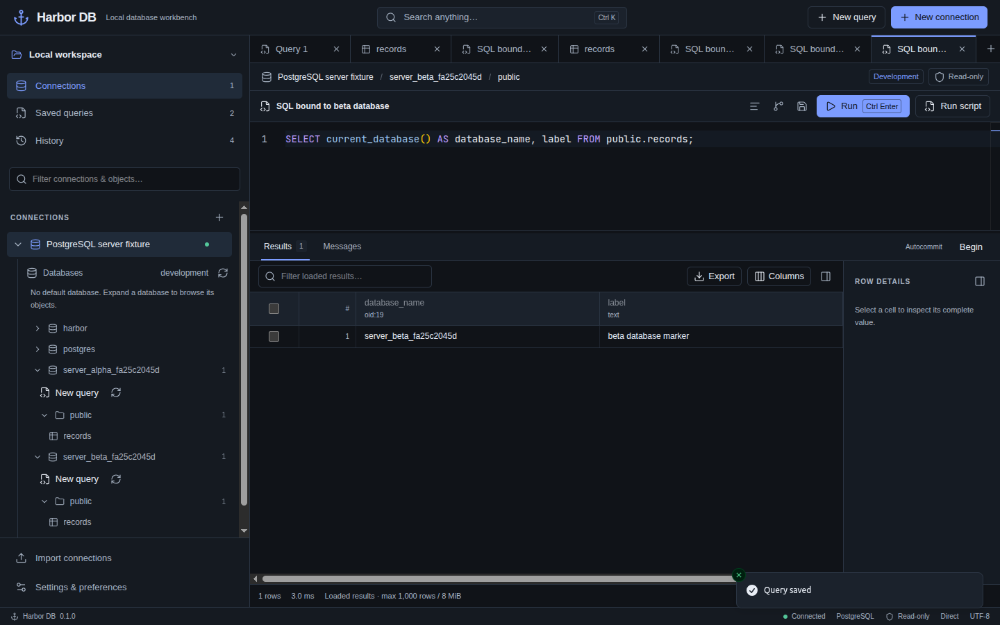

# Validation record

Runtime validation date: 2026-09-14. Public v0.1.1 downloads verified on 2026-09-15. These results describe the local host, generated fixtures and GitHub release jobs below. They do not establish behavior on every operating-system version, server version or network condition.

## Host and fixtures

- Linux x86-64, kernel 7.0.0-31-generic; Node.js 24.12.0 for development commands.
- Actual application runtime: Electron 44.3.0, Node.js 24.20.0, Chromium 152.0.7977.78 and bundled SQLite 3.53.4.
- Real Docker services: PostgreSQL 17, MariaDB 11.4 and standalone Redis 8, using loopback-only ports and the development credentials in Compose.
- Seeded datasets: 100,000 order rows and 12 customers per SQL engine, plus 100,000 Redis benchmark keys and examples of each supported value type.
- Electron tests use isolated application-data directories and generated fixture schemas, databases and keys. No user production database was accessed.

## Automated checks

| Check                                                | Result                                        |
| ---------------------------------------------------- | --------------------------------------------- |
| Strict TypeScript, ESLint and Prettier               | Passed                                        |
| Unit and real-engine integration suite               | 138 passed; one opt-in benchmark skipped      |
| Dependency audit, including development dependencies | 0 reported vulnerabilities at validation time |
| Electron desktop acceptance                          | 2 passed                                      |
| Electron SQL UI acceptance                           | 3 passed                                      |
| Electron Redis UI acceptance                         | 1 passed                                      |
| Electron MariaDB server explorer                     | 1 passed                                      |
| Electron table SQL and multi-row deletion            | 2 passed                                      |
| Electron explicit PostgreSQL database chooser        | 1 passed                                      |
| Electron PostgreSQL server explorer                  | 1 passed                                      |
| Electron TimescaleDB explorer and catalog paging     | 1 passed                                      |
| Electron saved-query persistence and theme contrast  | 1 passed                                      |
| Packaged Linux acceptance and OS-keyring restart     | Passed                                        |

A clean `npm ci`, including Electron's binary installation, passed in an empty temporary directory. Production compilation and Linux unpacked packaging passed. The packaged application reported `app.isPackaged`, loaded local `file:`/ASAR assets, used bundled SQLite and all three real database drivers, preserved exact decimal results and editor drafts, and produced no renderer page errors.

Integration tests use real servers. Credential, migration and selected failure cases use controlled boundaries. Five PostgreSQL startup-fallback cases inject only the initial connection error, then use real connections for successful fallbacks. The export E2E substitutes a temporary path for the native save-dialog response; IPC validation, the serialization worker and the disk write remain real.

### Database and editing coverage

Desktop acceptance covers profile creation, full-process restart and draft restoration, file export, all three engine bridges, numeric precision, transaction isolation, cancellation, Redis TTL and the command palette. SQL UI acceptance covers PostgreSQL and MariaDB table edits and discard, pending work across navigation, binary fidelity, exact count, read-only controls, CSV mapping and rollback, and connection-bound query tabs. Redis acceptance covers incremental discovery, draft preservation, string and hash edits, TTL preservation, concurrent-change conflicts and read-only rejection.

The MariaDB explorer regression uses a profile with no default database. Backend tests distinguish populated and empty databases, verify permission-filtered discovery and qualified reads/edits, and confirm that `DATABASE()` remains NULL. Electron coverage expands database nodes, displays real rows, reconnects a collapsed connection and changes to an explicit default without retaining another database's cached objects.

PostgreSQL coverage includes both explicitly configured databases and a blank Database server profile. The explicit chooser opens a separate profile while preserving production/read-only settings; the original profile and query tab keep their target. The server explorer uses two generated databases with identically named `public.records` tables and distinct values. Database/schema expansion, table reads, query targeting, unbound-tab selection, saved-query execution, catalog refresh and reconnect preserve each database context. Thirteen backend cases cover metadata/structure, edits, pending-session isolation, transactions, cancellation, reserved metadata-session identifiers, startup fallback policy and disconnect cleanup.

The table workbench's displayed SELECT follows server filtering, sorting and pagination. Real-engine tests compare the executable editor SQL with parameterized table reads under both PostgreSQL string modes and MariaDB backslash modes. Authored query results cannot be submitted as base-table edits. Both Electron workbench flows select two rows from a filtered 60-row table, cancel deletion and verify all rows remain, then confirm deletion and verify only the selected rows disappeared. Real-engine tests verify whole-batch rollback when a later selected row changes concurrently. Pending edits block query execution, and read-only connections or tables without a primary key disable deletion.

Selection regressions compare row highlights and checkboxes after cell and row-number clicks, Cmd/Ctrl toggles, Shift-click ranges, Shift-arrow changes, checkbox changes and Clear selection. Filtered ranges exclude hidden intervening rows. Rendered cell selection is checked; this regression does not validate system clipboard copying.

Saved-query acceptance verifies the table Save button and ordinary query Cmd/Ctrl+S, exact SQL and target persistence through a full process restart, unchanged table-tab names and reopening without automatic execution. Fixture data remains unchanged. The Run shortcut measured 4.65:1 text contrast in light mode and 7.14:1 in dark mode, including hover, at 1440×900. At 1024×700 the compact layout hides the shortcut while retaining the visible Run label.

### Credentials and sandbox verification

Playwright's default Electron loader appends basic password-store and mock-keychain switches. Under those switches, Electron reports `basic_text`, and Harbor correctly offers session-only authentication. The separate packaged-runtime test launches the executable directly without those switches: it reports protected `gnome_libsecret` storage, saves remembered credentials for all three engines, closes the process, and reconnects after restart by profile ID without supplying passwords. Locked/unavailable-keyring recovery is covered through an injected safeStorage boundary; a real locked-keyring test and other operating-system keyrings remain unverified.

The test harness explicitly sets `chromiumSandbox: true`; Playwright's default would disable it. Desktop and packaged tests check `sandbox: true`, `contextIsolation: true` and `nodeIntegration: false`, reject sandbox-disabling switches and inspect the real Linux renderer's `/proc` status. Passing runs reported `NoNewPrivs: 1`, seccomp mode `2`, one installed filter and PID-namespace depth `3`, compared with depth `1` in the main process. Packaged restart repeated these checks. No sandbox-disabling fallback was used.

Automated launches inherited an AppArmor profile that permits user namespaces. An ordinary terminal on the same host did not inherit that permission and could fail with Electron's SUID-helper diagnostic while `kernel.apparmor_restrict_unprivileged_userns=1` was enabled. Passing automation therefore does not establish ordinary-terminal startup. `npm run setup:linux` supplies a scoped AppArmor rule for the workspace's exact Electron and unpacked executable paths; installing it requires administrator authentication and leaves the global namespace restriction intact. Setup was not applied by automation, so ordinary-terminal launch after installation remains a separate check. See [Ubuntu's explanation of user-namespace restrictions](https://documentation.ubuntu.com/release-notes/24.04/#unprivileged-user-namespace-restrictions).

## Performance observations

`npm run benchmark` passed separately and measured a first bounded fetch through the real adapters. These are single local observations without concurrency or remote-network simulation. Time includes connection/setup work. Serialized result size is not total driver or network traffic.

| Engine / fixture               | Requested and retained            |   Elapsed | Serialized result |
| ------------------------------ | --------------------------------- | --------: | ----------------: |
| PostgreSQL, 100,000 order rows | 200 rows                          | 116.86 ms |      28,007 bytes |
| MariaDB, 100,000 order rows    | 200 rows                          |  56.95 ms |      27,322 bytes |
| Redis, 100,000 benchmark keys  | COUNT hint 200; 200 keys returned | 260.71 ms |      20,917 bytes |

The Redis cursor remained incomplete; this is not a full-scan measurement or exact progress estimate. SQL table browsing fetches bounded pages. Arbitrary authored queries are streamed/drained after their retained display budget and can still perform substantial server work. Column virtualization, full-output streaming exports and automatic idle eviction are outside this version; see [CAPABILITIES.md](CAPABILITIES.md).

## Visual and interaction review

The generated [workbench concept](design/harbor-concept.png) was compared with actual browser and Electron screens. Browser checks cover the labeled demo and first-run experience; database workflows were checked in real Electron sessions. The committed [PostgreSQL server explorer screenshot](screenshots/postgres-server.png) contains only generated local test databases.

Dark and light views at 1440×900 and compact views at 1024×700 were reviewed for meaningful content, usable controls, correct page identity, no framework overlays and no renderer console errors. Checks cover the compact toolbar, sidebar, editor-over-results layout, row virtualization, scroll containment, engine-aware SQL highlighting and sticky connection-dialog actions. The compact layout collapses the optional cell inspector while keeping primary actions reachable. Engine, environment, connection and safeguard states have text labels as well as color.

Keyboard tests include actual Monaco typing, execution and save shortcuts, tab context, focusable controls, labeled dialogs and grid edit entry. Full assistive-technology certification is not claimed. Native menus/window controls, explicit demo labeling, measured timings/counts, transaction controls and reviewed edits intentionally adapt the visual reference to real operations. Additional test captures and traces are generated artifacts excluded from publication.

## Platform status

Linux x64 unpacked packaging was built and launched with isolated application data. The approximately 470 MiB unpacked directory must be kept together; it loaded ASAR assets and connected to all three engines without renderer page errors.

Linux AppImage and Debian installers were also built locally. The extracted Debian package contains standard hicolor icons at 16, 24, 32, 48, 64, 128, 256 and 512 pixels; GTK resolved the expected sizes to those installed icon files. Desktop-file validation passed, and the launcher identity matches the packaged window's `WM_CLASS`. The packaged window exposed its native icon. Installer/removal script syntax and the scoped AppArmor policy passed validation; no system installation was performed by these checks.

## TimescaleDB regression verification in 0.1.1

Six new backend regressions run against ordinary PostgreSQL 17 and a dedicated TimescaleDB 2.27.1 / PostgreSQL 17.10 fixture. They verify hypertable and continuous-aggregate reads, custom-schema chunk filtering, SELECT-only access, preservation of user routines with extension-like names and dependencies, unrelated extension tables, and filtering 10,001 extension helper functions before the metadata result budget. The complete integration-enabled suite passed 138 tests with only the opt-in benchmark skipped.

The real Electron flow uses two generated databases with identically named hypertables and continuous aggregates but distinct rows. Both blank-server and explicitly configured database profiles preserve their targets. A schema containing 305 user routines proves that tables appear before routines and **Show more** reveals objects beyond the first 300; extension helpers and internal schemas are absent. The existing PostgreSQL server, configured PostgreSQL and MariaDB explorer tests also passed. The final Timescale flow was repeated against the optional Compose fixture and checked the visible version against the main process's version. Page identity, renderer console, error-overlay and actual sandbox checks passed at 1440×900; the new paging controls were not separately reviewed at compact widths.

The Timescale fixture uses loopback-only port 15433, a digest-pinned official image, temporary storage and generated test databases. No user database was inspected or changed. Screenshot evidence is generated outside the repository. This records local verification; the release workflow additionally enables the Timescale integration and Electron tests before publishing installers.

## Published v0.1.4

The [release workflow](https://github.com/aligeek-tech/harbor-db/actions/runs/34972475638) passed at commit `9fdc281aa797123c097a1b421d61781d51e0f0a9` and published [Harbor DB v0.1.4](https://github.com/aligeek-tech/harbor-db/releases/tag/v0.1.4) on 2026-09-15. It passed lint, type checking, production compilation, 76 unit tests, 140 integration-enabled tests, all 17 Electron UI tests, separate packaged Linux acceptance, and native installer builds for all four platform/architecture combinations. The opt-in benchmark was not run.

The Timescale regression creates a composite-key hypertable whose physical column order differs from its primary-key index order, fills multiple chunks, and compresses them. The default preview returns its requested row limit without an ORDER BY; EXPLAIN confirms there is no Sort or Incremental Sort node. Explicit sorting still works, and ordinary PostgreSQL tables use index key order. Composite-key updates are verified on a fresh uncompressed chunk. The existing SELECT FOR UPDATE restriction on compressed Timescale tuples remains; row locking was not weakened.

Read-only diagnosis of the reported production table compared EXPLAIN plans without executing the original expensive sort. The replacement unsorted preview query returned 200 rows in 282 ms in one bounded read-only execution. This is a single SQL timing, not an end-to-end application benchmark or guarantee for other tables. No production data, indexes, permissions, or database configuration were changed.

Electron validation used isolated application data and local Timescale fixtures at 1440×900 and 1024×700. It verified the unsorted-preview label, switching to explicit sorting, both server and fixed-database targets, renderer health, page identity, and the kernel sandbox. Screenshots outside the repository confirm the wrapping footer and pagination remain visible. The Browser skill was unavailable, so the repository's Electron Playwright workflow was used. Interactive macOS/Windows validation was not performed.

All seven installer URLs returned unauthenticated HTTP 200 with the expected Content-Length. The downloaded SHA256SUMS matched GitHub's asset digest, and every installer checksum matched its uploaded asset digest. Full published installers were not downloaded again. Published tags and binaries remain unchanged by this evidence update; existing signing limitations still apply.

## Published v0.1.3

The [release workflow](https://github.com/aligeek-tech/harbor-db/actions/runs/34958387874) passed at commit `e19302609e08984d552089b4fa72380d2fceb503` and published [Harbor DB v0.1.3](https://github.com/aligeek-tech/harbor-db/releases/tag/v0.1.3) on 2026-09-15.

The release passed lint, type checking, production compilation, 75 unit tests, 138 integration-enabled tests, all 17 Electron UI tests, separate packaged Linux acceptance, and native installer builds for all four platform/architecture combinations. Integration and packaged-only tests were skipped only in their non-applicable modes; the opt-in benchmark was not rerun.

The new second-launch regression failed against the previous startup code: the secondary process created a window and did not exit within 15 seconds. With the fix, it exits successfully without creating a window, sends the real single-instance handoff, and shows the hidden primary window. The primary retains its isolated workspace state and one window, with no renderer errors. The source test passed locally and under CI's Xvfb display.

Local cross-package checks also passed in both orders using the built 0.1.3 AppImage and the executable extracted from the 0.1.3 Debian package. These checks used temporary XDG configuration directories, verified Chromium's kernel sandbox, and did not install the Debian package or touch the user's workspace. Full macOS/Windows interactive second-launch testing was not performed.

All seven installer URLs returned unauthenticated HTTP 200 with the expected Content-Length. The downloaded `SHA256SUMS` matched GitHub's recorded asset digest, and each installer checksum matched its uploaded asset digest. Full published installers were not downloaded again. The published tag and binary assets remain unchanged by this evidence update. Existing signing limitations still apply.

## Published v0.1.2

The [release workflow](https://github.com/aligeek-tech/harbor-db/actions/runs/34954102582) passed at commit `b30737089e9f756dfd24880c8437b27b7f8a4999` and published [Harbor DB v0.1.2](https://github.com/aligeek-tech/harbor-db/releases/tag/v0.1.2) on 2026-09-15. [Issue #1](https://github.com/aligeek-tech/harbor-db/issues/1) was closed as completed after publication and download verification.

The release passed lint, type checking, production compilation, 75 unit tests, 138 integration-enabled tests, all 16 Electron UI tests, separate packaged Linux acceptance, and native installer builds for all four platform/architecture combinations. Integration and packaged-only tests were skipped only in their non-applicable modes; the opt-in benchmark was not rerun.

New Electron regressions reproduce incorrect passwords with both **Test connection** and **Save and connect** against PostgreSQL, MariaDB and Redis. They verify that the error remains fully inside the viewport with advanced settings open, the dialog stays open, credentials are not echoed, correcting the password clears stale feedback, and valid credentials reconnect successfully. These checks pass at 1024×700 in light mode and 1440×900 in dark mode, with real IPC, sandbox checks and no renderer errors. PostgreSQL backend checks also preserve valid syntax-error positions while omitting absent positions from authentication errors.

All seven installer URLs returned unauthenticated HTTP 200 with the expected Content-Length. The downloaded `SHA256SUMS` matched GitHub's recorded asset digest, and each installer checksum matched its uploaded asset digest. Full installers were not downloaded again. The published tag and binary assets remain unchanged by this evidence update. Existing macOS/Windows interactive validation and signing limitations still apply.

## Published v0.1.1

The [release workflow](https://github.com/aligeek-tech/harbor-db/actions/runs/34865879323) passed at commit `6dec1bd9fd923dd2de365a3dc9e07bc7744ae778` and published [Harbor DB v0.1.1](https://github.com/aligeek-tech/harbor-db/releases/tag/v0.1.1) on 2026-09-14.

- ESLint, strict TypeScript and production compilation passed.
- Unit suite: 75 passed; 64 integration/benchmark cases intentionally skipped.
- Integration-enabled suite, including real TimescaleDB: 138 passed; one opt-in benchmark skipped.
- Electron UI suite: 13 passed; the packaged-only case skipped in this mode. Separate packaged Linux acceptance: one passed.
- Windows and macOS unpacked verification and all four native installer build jobs passed.
- Seven installers and `SHA256SUMS` are public for Linux x64, Windows x64, Intel Mac and Apple Silicon.

Public download verification on 2026-09-15 confirmed HTTP 200 and matching Content-Length for every installer. The downloaded checksum file matched GitHub's asset digest, and all seven installer checksums matched GitHub's recorded asset digests; the full installers were not downloaded again. The published release and all assets were also verified in Chrome.

The final local Electron suite passed all 13 UI tests. Tests now wait for the initial document load and completed renderer bootstrap before seeding and reloading their isolated workspaces, and close the app through Playwright's normal lifecycle. This fixes the startup race that blocked the first release attempt; the UI assertions and sandbox checks remain enabled. No user database was accessed.

Platform signing and interactive macOS/Windows validation limitations remain as described below and in [RELEASE.md](RELEASE.md). This evidence update does not change the published tag or binary assets.

## Published v0.1.0

The [release workflow](https://github.com/aligeek-tech/harbor-db/actions/runs/34859725745) passed at commit `419810045c1fa2076ce2f16ea8942d255b3809f7` and published [Harbor DB v0.1.0](https://github.com/aligeek-tech/harbor-db/releases/tag/v0.1.0).

| Remote check                                                            | Result                                      |
| ----------------------------------------------------------------------- | ------------------------------------------- |
| ESLint, strict TypeScript and production build                          | Passed                                      |
| Unit suite                                                              | 75 passed; 58 opt-in cases skipped          |
| Unit suite with real database integration enabled                       | 132 passed; one opt-in benchmark skipped    |
| Electron UI suite                                                       | 12 passed; packaged-only case skipped       |
| Separate packaged Linux smoke test                                      | 1 passed                                    |
| Windows and macOS unpacked packaging                                    | Passed                                      |
| Native Linux x64, Windows x64, macOS Intel and Apple Silicon installers | All four build jobs passed                  |
| Complete release publication                                            | Seven installers and `SHA256SUMS` published |

Every installer URL returned HTTP 200 without authentication and the expected content length. The downloaded `SHA256SUMS` matched GitHub's recorded digest, and every installer checksum in that file matched GitHub's digest for the uploaded asset. The public repository and all release assets were also verified in Chrome.

Windows and macOS installers were built on their respective native GitHub runners; interactive installation, database workflows and OS-keychain behavior on those systems remain unverified. Windows installers are unsigned, and macOS builds use ad-hoc signatures without Developer ID signing or notarization. See [RELEASE.md](RELEASE.md) for installation and signing details. Released binary assets and the published tag remain unchanged when this evidence record is updated.

## v0.1.5 local verification

On 2026-09-15, lint, TypeScript checks and the production build passed. The integration-enabled suite passed 166 tests, with only the opt-in benchmark skipped. All 18 Electron desktop tests passed; the packaged Linux acceptance test passed separately. Nine MongoDB cases use an isolated MongoDB 7 fixture: authorized catalogs, filtered/sorted pagination, aggregation with blocked write stages, BSON ObjectId/date/long/decimal/binary round trips, confirmed single-document writes and stale-original conflicts, case-only conflicts under a case-insensitive collection collation, read-only enforcement, a bounded large preview, verified TLS with rejection of the wrong certificate hostname, and failed-authentication cleanup. The test count groups related assertions into nine cases.

The MongoDB Electron flow verifies collection discovery, both sort buttons, the first double-click opening the document editor, replacement/insert/delete through confirmations, filtered queries, read-only aggregation results, saved-query collection/mode restoration, and connection-URL parsing plus a successful connection test. Visual review covers 1440×900 dark mode, 1024×700 light/dark mode, and the document/connection dialogs. The selection bar keeps its space when editing is supported, preventing the first click from moving the row before the second click arrives. PostgreSQL and MariaDB workbench flows also verify loaded-result sorting keeps the original row selected and checkbox state synchronized.

The packaged Linux acceptance test connects through all four bundled drivers, reads MongoDB system-version metadata through the validated bridge, and verifies packaged assets, SQLite, renderer isolation and the actual Chromium sandbox. Live MongoDB verification uses a standalone fixture and a local TLS proxy; Atlas/SRV and replica-set deployments have not been exercised. Windows and macOS runtime interaction testing remains outside this local environment.

The initial v0.1.5 release workflow stopped at `npm ci` because the older local npm had omitted two bundled optional WASM dependencies from the lockfile. No v0.1.5 installers were published. The lockfile was repaired in an empty directory with CI's npm 11.19.0, preserving every existing dependency version, for release v0.1.6.

The v0.1.6 publication run was cancelled before publication after final review identified duplicate-name result columns sharing a sort target. Version 0.1.7 identifies local sort columns by position and name, and the PostgreSQL/MariaDB desktop regressions sort the second of two identically named columns in both directions. No v0.1.6 installers were published.

## Published v0.1.7

The [release workflow](https://github.com/aligeek-tech/harbor-db/actions/runs/34980894455) passed at commit `3a924779b0edfeefb8282ee4dda8864474a54544` and published [Harbor DB v0.1.7](https://github.com/aligeek-tech/harbor-db/releases/tag/v0.1.7) on 2026-09-15.

Lint, strict TypeScript and production compilation passed. The unit suite passed 93 tests; the integration-enabled suite passed 166 tests with only the opt-in benchmark skipped. All 18 desktop tests passed, with the packaged case run separately and passing. PostgreSQL and MariaDB desktop tests verify that sorting the second of two identically named columns uses its own values and indicator. Windows/macOS unpacked checks and all four native installer build jobs passed.

All seven installer links returned HTTP 200 without authentication and the expected Content-Length. The downloaded `SHA256SUMS` file matched GitHub's recorded asset digest, and every installer checksum in that file matched GitHub's recorded digest for the corresponding uploaded binary. The full installers were not downloaded again. Published tags and binaries were not modified during this verification.

| Installer                               |     Bytes | Public download / checksum |
| --------------------------------------- | --------: | -------------------------- |
| `Harbor-DB-0.1.7-linux-amd64.deb`       | 124808452 | HTTP 200 / matched         |
| `Harbor-DB-0.1.7-linux-x86_64.AppImage` | 162520367 | HTTP 200 / matched         |
| `Harbor-DB-0.1.7-mac-arm64.dmg`         | 163785119 | HTTP 200 / matched         |
| `Harbor-DB-0.1.7-mac-arm64.zip`         | 163903653 | HTTP 200 / matched         |
| `Harbor-DB-0.1.7-mac-x64.dmg`           | 169846431 | HTTP 200 / matched         |
| `Harbor-DB-0.1.7-mac-x64.zip`           | 169975299 | HTTP 200 / matched         |
| `Harbor-DB-0.1.7-win-x64.exe`           | 137949892 | HTTP 200 / matched         |

Interactive Windows/macOS workflows and Atlas/SRV or replica-set deployments remain unverified; the local MongoDB and TLS fixture coverage is described above.
